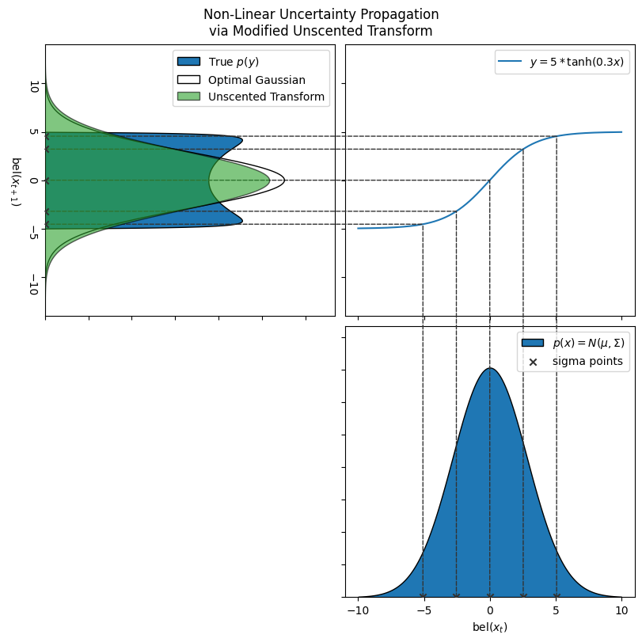

# A Variant of The Unscented Kalman Filter for Highly Non-Linear State Estimation
Russell Schwartz and Ian Krause

**Abstract:** State estimation for non-linear systems is challenging, even when we restrict our belief model to a Gaussian distribution, as in the case of the Kalman Filter. The EKF and UKF both use approximation schemes to make the problem tractable. The UKF often achieves better performance over the EKF. In part, it does this by consulting the dynamics model on a larger portion of the state space through its selection of so-called sigma-points. In this work we explore a novel variant of the usual sigma-point selection scheme that selects more than the usual $2n+1$ points from more than one distance about the mean. These modifications help to resolve some of the error experienced by the original UKF (especially in systems with strong 3rd order behavior) at the cost of modestly increased computational cost. We compare this method to baseline EKF and UKF implementations in a number of simulated environments, including the tracking of a double-inverted-pendulum and a SLAM task. Our proposed ``UKF2" exhibits increased state-estimation accuracy and a lower rate of divergence over both the EKF and UKF in all of these systems.

**Paper:** TODO LINK!

**Project Structure**

 - `src/filters`: system model framework and filter implementations
 - `src/probability`: probability utils, including genric unscented transform
 - `src/testing`: example system implementations and testing notebooks
